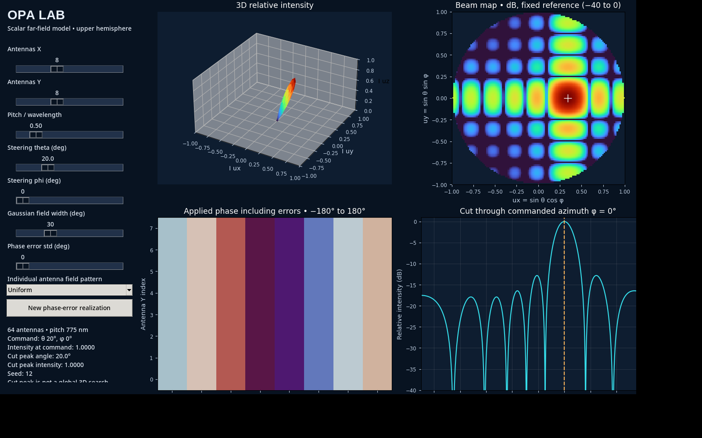

# Optical Phased Array (OPA) Beam-Steering Simulator

Interactive Python dashboard for exploring the scalar far-field response of a two-dimensional optical phased array (OPA). The GUI provides real-time control of array geometry, beam-steering angles, individual element radiation pattern, and random phase errors, while visualizing the resulting far-field beam in several complementary forms.

The current model uses a fixed reference wavelength of **1550 nm** and is intended as an educational/design-exploration tool for OPA beam steering and array-factor behavior.



## Features

- Rectangular OPA with independently selectable numbers of elements in the X and Y directions.
- Element pitch specified in units of wavelength, from 0.25λ to 2λ.
- Electronic beam steering through polar angle **θ** and azimuthal angle **φ**.
- Four individual element field-pattern models:
  - Uniform
  - Gaussian
  - Cosine
  - Sinc aperture
- Gaussian-distributed random phase errors with user-selectable standard deviation.
- New random phase-error realization using a reproducible random seed.
- Four live visualizations:
  1. 3D relative far-field intensity.
  2. 2D direction-cosine beam map in dB.
  3. Applied phase distribution across the array.
  4. Signed angular intensity cut through the commanded azimuth.
- Export of the current dashboard plots to PNG.
- Built-in numerical model checks via `python opa_gui.py --check`.

## Physical Model

### Array geometry

For an `Nx × Ny` planar array, the element coordinates are centered around the origin. The pitch `d` is entered as a normalized quantity `d/λ`, so the code works directly in wavelength-normalized coordinates.

For element position vector

```text
r_n = (x_n, y_n)
```

and commanded steering direction

```text
u_s = (sin(theta_s) cos(phi_s), sin(theta_s) sin(phi_s)),
```

the commanded phase is

```text
phi_n = -2*pi*(r_n dot u_s) + epsilon_n,
```

where `epsilon_n` is an optional random phase error.

The phase error is modeled as

```text
epsilon_n ~ Normal(0, sigma_phi^2).
```

### Far-field array factor

For an observation direction represented by the direction cosines

```text
u_x = sin(theta) cos(phi)
u_y = sin(theta) sin(phi),
```

the normalized scalar field is

```text
E(u_x,u_y) = g(u_x,u_y)/N * sum_n exp[j*2*pi*(x_n*u_x + y_n*u_y) + j*phi_n],
```

where:

- `N = Nx * Ny` is the total number of array elements.
- `g(u_x,u_y)` is the selected individual-element field pattern.
- The factor `1/N` normalizes the ideal coherent beam peak to unity.

The displayed relative intensity is

```text
I(u_x,u_y) = |E(u_x,u_y)|^2.
```

The 2D beam map is displayed in dB as

```text
I_dB = 10*log10(I),
```

with the GUI floor limited to **−40 dB**.

## Element Pattern Models

The model multiplies the OPA array factor by a scalar field-envelope `g`:

| Pattern | Field-envelope used in the GUI |
|---|---|
| Uniform | `g = 1` |
| Gaussian | `g = exp[-(theta / width)^2]` |
| Cosine | `g = cos(theta)` over the upper hemisphere |
| Sinc aperture | `g = sinc(u_x) sinc(u_y)` |

`numpy.sinc()` uses the normalized definition `sin(pi*x)/(pi*x)`.

## Understanding the Plots

### 1. 3D relative intensity

The radius of the plotted surface represents **relative intensity**. It is not a propagating optical wavefront. This view is useful for visualizing the main-lobe direction and large sidelobes or grating lobes.

### 2. Beam map in direction-cosine space

The map uses

```text
u_x = sin(theta) cos(phi)
u_y = sin(theta) sin(phi).
```

Only points satisfying

```text
u_x^2 + u_y^2 <= 1
```

belong to the propagating upper hemisphere. The white `+` marks the commanded steering direction.

### 3. Applied phase map

The phase map shows the phase applied to every array element, wrapped to the interval **−180° to +180°**. If phase-error standard deviation is nonzero, the random error is included in this map.

### 4. Angular cut

The lower-right plot shows a signed angular cut from **−90° to +90°** through the commanded azimuth. The dashed line indicates the commanded polar steering angle. The reported cut peak is a peak along this one-dimensional cut and is **not** a global three-dimensional peak search.

## Pitch and Grating Lobes

The pitch control intentionally extends beyond `0.5λ`. This makes it possible to investigate the appearance of additional array-factor maxima as pitch and steering angle increase. These features are useful for understanding the grating-lobe constraint in practical optical phased arrays.

## Model Assumptions and Limitations

This program is a **scalar array-factor model**, not a full-wave electromagnetic solver. The current implementation assumes:

- Equal unit-amplitude excitation of every element.
- Fixed reference wavelength of 1550 nm.
- Identical element patterns for all emitters.
- No mutual coupling between neighboring elements.
- No propagation loss or material loss.
- No polarization dependence.
- No fabrication-induced amplitude errors.
- No wavelength dispersion or broadband behavior.
- Far-field observation only.

For detailed OPA design, these effects can be added or evaluated using electromagnetic tools such as FDTD/FEM solvers.

## Requirements

- Python 3.10 or newer recommended
- NumPy
- Matplotlib
- Tkinter

Tkinter is normally included with standard Python installations on Windows and macOS. On some Linux distributions it must be installed separately, for example:

```bash
sudo apt install python3-tk
```

## Download and Run

### Option 1 — Download ZIP from GitHub

1. Open the repository on GitHub.
2. Select **Code → Download ZIP**.
3. Extract the downloaded ZIP file.
4. Open a terminal or PowerShell window inside the extracted folder.
5. Create a virtual environment:

```bash
python -m venv .venv
```

6. Activate it.

Windows PowerShell:

```powershell
.\.venv\Scripts\Activate.ps1
```

macOS/Linux:

```bash
source .venv/bin/activate
```

7. Install the Python dependencies:

```bash
python -m pip install -r requirements.txt
```

8. Start the GUI:

```bash
python opa_gui.py
```

### Option 2 — Clone with Git

```bash
git clone https://github.com/YOUR-USERNAME/optical-phased-array-beam-steering-gui.git
cd optical-phased-array-beam-steering-gui
python -m venv .venv
```

Then activate the environment, install `requirements.txt`, and run `python opa_gui.py` as described above.

## Verify the Numerical Model

The script includes three compact checks for basic array behavior, Gaussian element-pattern weighting, and planar steering:

```bash
python opa_gui.py --check
```

Expected output:

```text
Model checks passed: three-element cancellation, Gaussian weighting, planar steering.
```

## Typical Experiments

Some useful parameter sweeps to explore with the GUI are:

- Increase pitch above `0.5λ` and observe how additional lobes emerge.
- Increase the steering angle while holding pitch fixed.
- Compare Uniform and Gaussian element patterns and observe how the element envelope modifies the total radiation pattern.
- Increase phase-error standard deviation and observe beam degradation and sidelobe changes.
- Change array size to examine main-lobe narrowing as the effective aperture increases.

## Repository Structure

```text
optical-phased-array-beam-steering-gui/
├── opa_gui.py
├── requirements.txt
├── README.md
├── .gitignore
└── docs/
    └── images/
        └── opa_gui_screenshot.png
```

## Suggested GitHub Repository Description

> Interactive Python GUI for scalar far-field simulation and visualization of 2D optical phased arrays, including beam steering, element patterns, phase errors, phase maps, and far-field intensity plots.

## Suggested GitHub Topics

`optical-phased-array` · `opa` · `beam-steering` · `photonics` · `silicon-photonics` · `array-factor` · `python` · `tkinter` · `numpy` · `matplotlib`

## Notes

This project is intended for simulation, visualization, and educational exploration of OPA beam-steering concepts. It should not be interpreted as a complete electromagnetic model of a fabricated OPA device.
